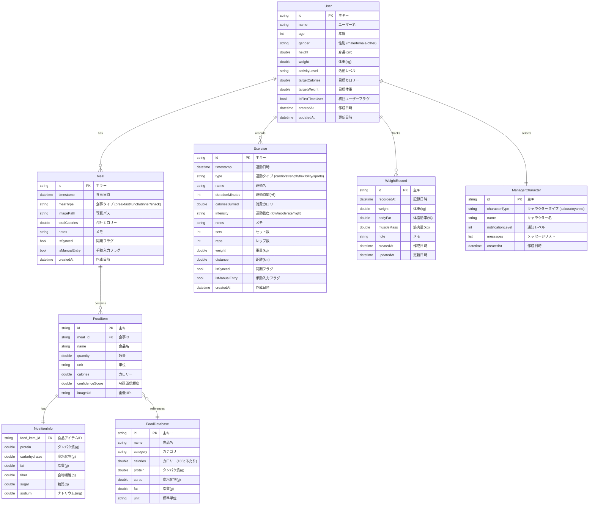

# Calorie Checker AI - ER図

## エンティティ関係図 (Entity Relationship Diagram)



## 主要なリレーションシップ

### 1. User - Meal (1:多)
- 1人のユーザーは複数の食事記録を持つ
- 各食事記録は1人のユーザーに属する

### 2. User - Exercise (1:多)
- 1人のユーザーは複数の運動記録を持つ
- 各運動記録は1人のユーザーに属する

### 3. User - WeightRecord (1:多)
- 1人のユーザーは複数の体重記録を持つ
- 各体重記録は1人のユーザーに属する

### 4. User - ManagerCharacter (1:1)
- 1人のユーザーは1つのマネージャーキャラクターを選択
- キャラクター設定はユーザーごとに保存

### 5. Meal - FoodItem (1:多)
- 1回の食事は複数の食品アイテムを含む
- 各食品アイテムは1つの食事に属する

### 6. FoodItem - NutritionInfo (1:1)
- 各食品アイテムは1つの栄養情報を持つ
- 栄養情報は食品アイテムごとに計算される

### 7. FoodItem - FoodDatabase (多:1)
- 複数の食品アイテムが同じ食品データベースエントリを参照可能
- 食品データベースはマスターデータとして機能

## データベース設計の特徴

### 1. **正規化**
- 栄養情報を別テーブルに分離
- 食品マスターデータの分離
- 重複データの最小化

### 2. **拡張性**
- 新しい栄養素の追加が容易
- カスタム食品の追加対応
- 運動タイプの柔軟な拡張

### 3. **データ整合性**
- 外部キー制約による参照整合性
- enum型による値の制約
- NOT NULL制約による必須項目管理

### 4. **パフォーマンス考慮**
- 日付ベースのインデックス
- ユーザーIDによるパーティショニング
- 頻繁にアクセスされるデータの最適化

## 主要なインデックス

```sql
-- ユーザー別の食事記録検索用
CREATE INDEX idx_meals_user_timestamp ON meals(user_id, timestamp);

-- 日付範囲での検索用
CREATE INDEX idx_meals_timestamp ON meals(timestamp);

-- 運動記録の検索用
CREATE INDEX idx_exercises_user_timestamp ON exercises(user_id, timestamp);

-- 体重記録の検索用
CREATE INDEX idx_weight_records_user_recorded ON weight_records(user_id, recorded_at);

-- 食品データベースの検索用
CREATE INDEX idx_food_database_category ON food_database(category);
CREATE INDEX idx_food_database_name ON food_database(name);
```